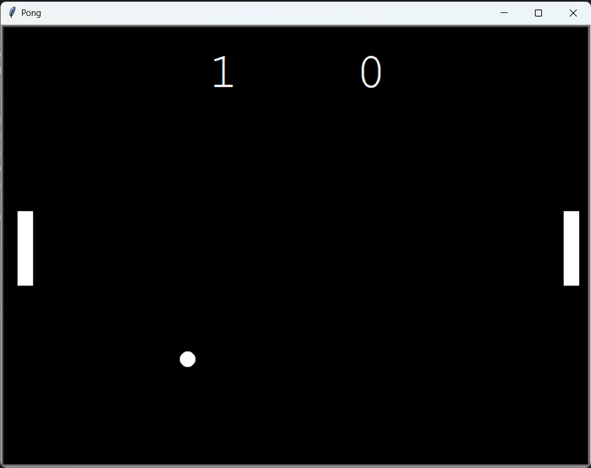

# 🎮 Pong Game

A classic Pong game built with Python's Turtle Graphics module! This two-player game allows you to control paddles on either side of the screen, competing to score points by bouncing the ball past your opponent's paddle.

---

## 🕹️ Game Features

- **Two-Player Control:**
  - **Right Paddle (Player 1):** Arrow Keys (**Up**, **Down**)
  - **Left Paddle (Player 2):** `W` (Up), `S` (Down)
- **Dynamic Ball Movement:**
  - Bounces off the top and bottom walls.
  - Reflects back upon hitting a paddle.
- **Real-Time Scoring:**
  - Track points for each player.
  - Automatically updates the scoreboard with each score.

---

## 📂 Project Files

| File           | Description                                                     |
|----------------|-----------------------------------------------------------------|
| **main.py**    | Main game loop and control logic.                               |
| **scoreboard.py** | Manages the scoreboard and point-keeping system.               |
| **ball.py**    | Ball movement and collision mechanics.                          |
| **paddle.py**  | Paddle properties and movement functions.                       |

---

## 🛠️ Requirements

- **Python 3.x**
- **Turtle Graphics** (pre-installed with Python)

---

## 🚀 Getting Started

1. **Clone the repository**:
   ```bash
   git clone https://github.com/shrutimsontakke/pong-game.git
   ```
   
2. **Navigate to the project folder**:
   ```bash
   cd pong-game
   ```
   
3. **Run the game**:
   ```bash
   python main.py
   ```

---

## 🎯 How to Play

- **Right Paddle (Player 1)** uses **Up** and **Down** arrow keys.
- **Left Paddle (Player 2)** uses **W** (up) and **S** (down) keys.
- The goal is to bounce the ball to the opponent's side and score points when they miss!
  
---

## 📸 Screenshots



---

## 🤝 Contributing

Contributions are welcome! Fork the repository, make your changes, and submit a pull request. Let's make this game even better together!

---

